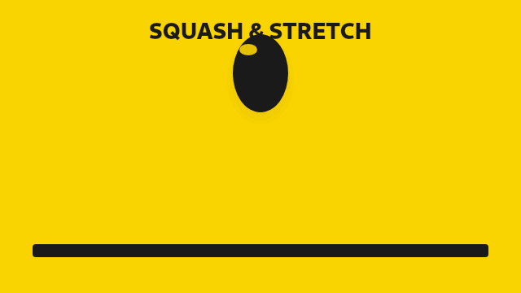
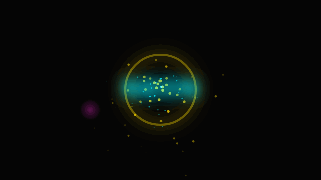

<p align="center">
  
</p>

<h1 align="center">Paint Studio</h1>

<p align="center">
  <b>Agent-friendly animation studio.</b> Author <code>.paint.json</code> projects, render GIF/PNG from the CLI, or draw in a bold black &amp; yellow editor — same TypeScript core everywhere.
</p>

<p align="center">
  <a href="https://mazin7d4.github.io/PaintWebApp/">Live demo</a> ·
  <a href="AGENTS.md">AGENTS.md</a> ·
  <a href="schemas/paint-project.schema.json">JSON Schema</a> ·
  <a href="examples/">Examples</a>
</p>

<p align="center">
  
  
  
</p>

## Why

Coding agents should be able to **produce real animations** — not just screenshots of a paint toy. Paint Studio gives them:

1. A **versioned JSON document** (layers, frames, brushes, keyframes, camera)
2. A **headless CLI** (`check` → `render`) that exports GIF / PNG / sprite sheets
3. A **shared renderer** so the editor preview matches the CLI output
4. **Style presets + brush engine** so results look intentional (ink, neon, pixel, painterly…)

## Quick start

```bash
npm install
npm run build

# Validate & render an example (no browser)
npx paint-studio check examples/bouncing-ball.paint.json
npx paint-studio render examples/ink-logo-reveal.paint.json -o examples/out/ink-logo-reveal.gif
npx paint-studio render examples/neon-pulse.paint.json -o examples/out/neon-pulse.gif

# Editor
npm run dev
```

Or with the published-style bin after build:

```bash
node packages/cli/dist/bin.js create my-shot.paint.json --style neon --fps 24
node packages/cli/dist/bin.js render my-shot.paint.json -o my-shot.gif
```

## Example gallery (CLI-authored)

| Animation | Style | Command |
|-----------|-------|---------|
| Ink logo reveal | `inked-cartoon` | `render examples/ink-logo-reveal.paint.json` |
| Squash & stretch ball | `flat-vector` | `render examples/bouncing-ball.paint.json` |
| Neon pulse | `neon` | `render examples/neon-pulse.paint.json` |

<p align="center">
  
  
</p>

## Packages

| Package | Role |
|---------|------|
| `@paint-studio/core` | Project model, brushes, tweening, validator, renderer |
| `paint-studio` | CLI — create / check / render / export-hyperframes |
| `@paint-studio/web` | Vite editor (black/yellow), `window.paintStudio` API |

## Editor features (v2)

Undo/redo · onion skin · layers (visibility/lock) · timeline (add/dup/delete/play/loop) · brushes (ink/pencil/marker/airbrush/charcoal/neon/watercolor) · shapes · fill · eyedropper · zoom · pixel grid · style presets · import/export `.paint.json` · IndexedDB-free **localStorage autosave** · canvas resize handle · pressure-aware pointer strokes

## Agent workflow

See **[AGENTS.md](AGENTS.md)** for art direction, schema notes, and the create → check → render loop (inspired by [Hyperframes](https://github.com/heygen-com/hyperframes) agent UX — we keep MIT and our own canvas/GIF pipeline; optional HTML export for Hyperframes MP4).

## GitHub Pages

`.github/workflows/pages.yml` builds the Vite app and deploys it. This **supersedes** draft PRs #3/#4 (not modified here).

## License

MIT © Paint Studio contributors
